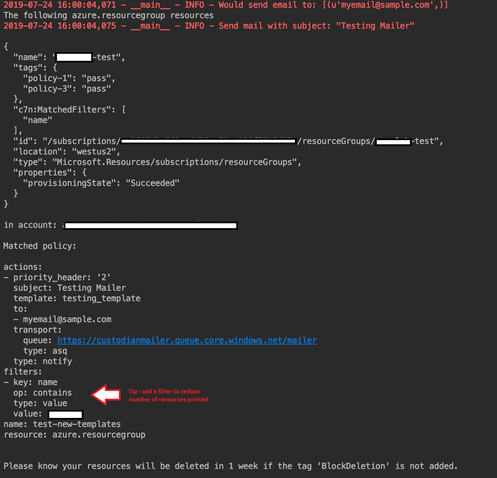

# Customizing Jinja2 templates for notifications
The Custodian Mailer uses [Jinja2](http://jinja.pocoo.org/]) for formatting messages. There are [default Jinja templates](https://github.com/cloud-custodian/cloud-custodian/tree/master/tools/c7n_mailer/c7n_mailer/msg-templates) in Cloud Custodian, but if these do not match the desired message format then custom templates can be used. 

## Pre-requisites for scenario
* Cloud Custodian is installed with the Azure and Mailer plugins. (See Step 1 from [Sending Notifications using an SMTP server](../smtp-delivery/README.md) for reference to install if not done already.) 

## Testing custom Jinja2 templates
The Custodian Replay tool can be used to test new templates and comes installed with the Custodian Mailer. The mailer defaults to looking inside the default template directory for the jinja2 template, but it's possible to provide it a custom directory. This example will put it in a custom directory:

1. Create a new file called <b>testing-template.j2</b> inside a new directory <b>custodian/custom-templates</b>. 

2. A possible scenario for notifications is to warn users their resources will be deleted without action. The example template in this scenario will address that. Copy the following content into your new jinja file:

    ```jinja
    The following {{ policy['resource'] }} resources

    
    {{ format_resource(resource, policy['resource']) }}
    

    in account: {{ account }}

    Matched policy:

    {{ policy|yaml_safe(default_flow_style=False) }}

    Please know your resources will be deleted in 1 week if the tag 'BlockDeletion' is not added. 
    ```

3. A locally saved message is required to test the new template. One way to get a message locally is to run a Custodian policy with the `notify` action. This will add a message in an Azure Queue and then the message can be directly retrieved from the queue and saved locally:

    a. Create a new Azure Queue - see Step 2 instructions in [Sending Notifications using an SMTP server](../smtp-delivery/README.md) for help. 

    b. Create a policy file <b>template-test.yml</b> with the following content: 

    ```yaml
    policies:
        - name: test-new-templates
    resource: azure.resourcegroup
    actions:
        - type: notify
          template: testing-template
          priority_header: '2'
          subject: Testing Mailer
          to: 
              - myemail@sample.com
          transport:
              type: asq
              queue: https://custodianmailer.queue.core.windows.net/mailer
    ```

    <b>NOTE</b> - the template field is the name of the saved template from Step 1 (without the file extension), and the queue field is the url of the queue from the one created in the previous step. 

    c. Run the policy with the command:

    `custodian run template-test.yml -s log`

    d. Retrieve the message from the queue with the Azure cli command:

    `az storage message get --queue-name mailer --account-name custodianmailer --query '[].content' > test_message.gz`

    This saves the content of the message from the queue in a zipped file named <b>test_message.gz</b> that can be passed to the Custodian Replay tool for testing. This message can be reused as often as needed while testing the new template. 

4. Running the Custodian Replay tool requires a config `mailer.yml` file. Since the replay tool does not deliver the message, the file only requires the `queue_url` and `from_address`. Create a <b>mailer.yml</b> file with the following contents:

    ```yaml
    queue_url: asq://custodianmailer.queue.core.windows.net/mailer
    from_address: youremail@sample.com
    ```
5. Test the template with the Custodian Replay tool with the command:

    `c7n-mailer-replay test_message.gz -T --config mailer.yml --templates custodian/custom-templates`

    This will apply the <b>testing-template.j2</b> to the message and print it out in the console: 
    
