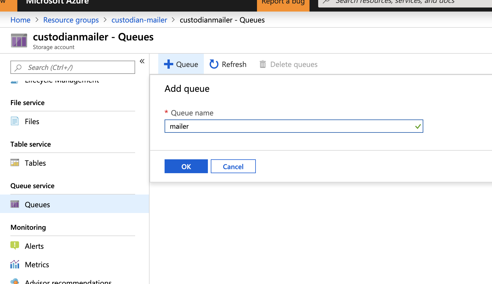

# Sending Notifications using an SMTP server
The Custodian Mailer subscribes to an Azure Storage Queue to deliver messages marked for notification from Cloud Custodian. It can be configured to send these messages using an SMTP server by following these steps:

1. Install c7n, c7n_azure, c7n_mailer:
      ```bash
      $ python3 -m venv custodian
      $ source custodian/bin/activate
      $ git clone https://github.com/cloud-custodian/cloud-custodian.git
      $ cd cloud-custodian
      $ pip install -e .
      $ pip install -e tools/c7n_azure
      $ pip install -e tools/c7n_mailer
    ```

2. Create a storage queue in your Azure Subscription. This will demonstrate creating one through the Azure portal:

    1. Search for 'Storage accounts' from the 'All Services' tab and click on 'Storage accounts':
    

    2. In the upper left corner click on the `+Add` button. Then configure your storage account:
    

    3. When the storage account has been created, go to the new resource and scroll down to the 'Queues' tab on the left side of the blade. Click on the tab and then click on the `+Queue` button at the top. Name your queue, and click `Ok`:
    

    4. When the queue is created it will generate a url. Copy everything from the url except for 'https' for use in your yaml policies in the next steps: 
     

3. To run the mailer, a Service Principal with the <b>Storage Queue Data Contributor</b> role is required. Follow instructions from the [Azure Custodian Authentication Docs](https://cloudcustodian.io/docs/azure/configuration/authentication.html#service-principal) to create a Service Principal and set the necessary environment variables. To assign the service principal the <b>Storage Queue Data Contributor</b> role, run the following command:

    `az role assignment create --assignee <sp_name> --role 'Storage Queue Data Contributor'`

4. In a text editor create a `mailer.yml` file with the following configurations:
    ```yaml
    queue_url: asq://custodianmailer.queue.core.windows.net/mailer
    from_address: john.smith@contoso.com
    smtp_server: smtp.example.com
    smtp_username: johnsmithusername@example.com
    smtp_password: johns_fake_password
    function_properties:
      servicePlan:
        name: 'testmailer1'
    ```

      * <b>queue_url</b> - url copied from step 2.4. 
      * <b>from_address</b> - the email address appearing as the sender.
      * <b>smtp fields</b> - the configurations for the smtp server being used to deliver the messages. Using an smtp server for the Custodian Mailer requires having a username and password with the server. 
      * <b>function_properties</b> - configures the resources for deploying the mailer to an Azure Function.

5. The mailer can be deployed to an Azure Function to continuously pull messages from the queue by running the command: 

    `c7n-mailer --config mailer.yml --update-lambda`

6. Adding the notify action to a policy will add messages to the queue that was created. The mailer will process these messages and use the SMTP server to send emails for each message. The following is an example policy for notifications (notice the queue url is the same one copied from earlier):

    ```yaml
    policies:
      - name: test-smtp-notifications
        description: Policy tests sending notifications using resource groups
        resource: azure.resourcegroup
        actions:
          - type: notify
            template: default
            priority_header: '2'
            subject: Hello from C7N mailer
            to:
              - youraddress@email.com
            transport:
              type: asq
              queue: https://custodianmailer.queue.core.windows.net/mailer
    ```

    To test the end-to-end, set the <b>to</b> field in the notify action to an accessible email address (e.g. your direct email). Then save the above policy in a file named <b>test-smtp-notification.yml</b>. Now run the policy with the command:

    `custodian run test-smtp-notification.yml -s log`

    An email should now be delivered to the email set in the <b>to</b> field on the policy. 

    The notify action can be used on any custodian policy, like notifying when a keyvault's [keys will expire](../../../key-vault/keys/rotate-keys/detect-expiring-keys.yaml). 